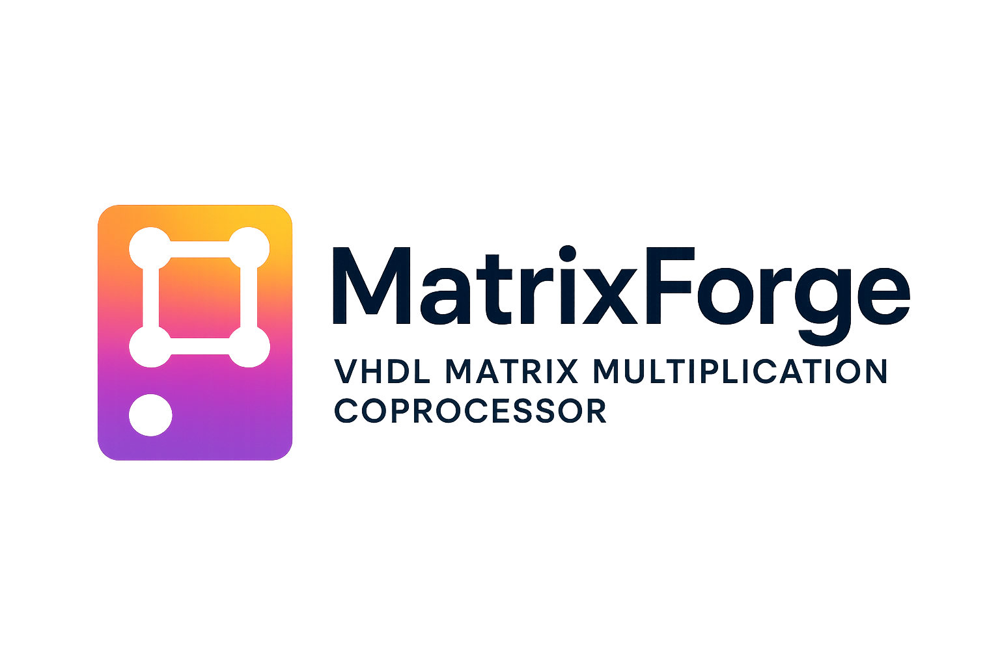

<div align="center">



# MatrixForge: VHDL Matrix Multiplication Coprocessor

</div>

<div align="center">


*MatrixForge: A high-performance VHDL coprocessor designed for 3×3 matrix multiplication operations using a column-by-column processing approach with integrated control and processing units.*

</div>

## 🔍 Project Overview

MatrixForge is a specialized hardware coprocessor implemented in VHDL that performs matrix multiplication on two 3×3 matrices. The system calculates the element-wise product of corresponding matrix positions column-by-column and accumulates the results to produce a single scalar output value.


### Mathematical Operation

MatrixForge computes the following operation:

```
Matrix A:          Matrix B:
[255, 200, 100]   [1,  0, -1]
[  5,  46, 180] × [1,  0, -1] = -220
[100, 200, 300]   [1,  0, -1]
```

**Calculation:** `255×1 + 5×1 + 100×1 + 200×0 + 46×0 + 200×0 + 100×(-1) + 180×(-1) + 300×(-1) = -220`


## 🏗️ System Architecture

MatrixForge consists of three main components working in synchronization:

### 1. Register File Unit (`RegisterFile.vhd`)
- **Data Registers**: Two 3×3 integer arrays storing input matrices
- **Instruction Registers**: 15-element array of 16-bit instruction codes
- **Result Register**: Stores the final computation result

### 2. Processing Unit (`ProcessingUnit.vhd`)
- Performs multiply-accumulate operations
- Manages data flow between registers and ALU
- Handles result accumulation and output

### 3. Control Unit (`ControlUnit.vhd`)
- Finite State Machine (FSM) implementation
- Instruction fetch, decode, and execution control
- Generates control signals for all system components


## 📋 Instruction Set Architecture (ISA)

| Opcode | Instruction | Description |
|--------|-------------|-------------|
| `0x0001` | **LOAD** | Fetches operand from data registers to processing unit |
| `0x0002` | **MUL/ADD** | Multiplies loaded values and accumulates result |
| `0x0003` | **STORE** | Saves final result to destination register |

## 🔧 Implementation Details

### Entity Interfaces

#### Coprocessor (Top-level)
```vhdl
entity Coprocessor is
    Port ( 
        clk : in STD_LOGIC;
        coprocessorResult : out INTEGER
    );
end Coprocessor;
```

#### RegisterFile
```vhdl
entity RegisterFile is
    Port ( 
        clk : in STD_LOGIC;
        pc : in INTEGER;
        i, j : in INTEGER;
        X_out, W_out : out INTEGER;
        instruction : out STD_LOGIC_VECTOR(15 downto 0);
        result : in INTEGER;
        readData, regRead, regWrite : in STD_LOGIC
    );
end RegisterFile;
```

#### ProcessingUnit
```vhdl
entity ProcessingUnit is
    Port ( 
        clk : in STD_LOGIC;
        X_in, W_in : in INTEGER;
        accout : out INTEGER;
        writeResult, loadData, aluEnable : in STD_LOGIC
    );
end ProcessingUnit;
```

#### ControlUnit
```vhdl
entity ControlUnit is
    Port ( 
        clk : in STD_LOGIC;
        pc : buffer INTEGER;
        i, j : buffer INTEGER;
        instruction : in STD_LOGIC_VECTOR(15 downto 0);
        readData, regRead, regWrite, aluEnable, writeResult, loadData : out STD_LOGIC
    );
end ControlUnit;
```


## 🚀 Getting Started

### Prerequisites
- **Xilinx ISE Design Suite** or compatible VHDL simulator
- Basic understanding of VHDL and digital design principles

### Project Structure
```
MatrixForge/
├── Coprocessor.vhd              # Top-level module
├── RegisterFile.vhd             # Memory and register management
├── ProcessingUnit.vhd           # Arithmetic operations
├── ControlUnit.vhd              # FSM control logic
├── CoProcessor_TestBench.vhd    # Simulation testbench
├── DigitalProject.xise          # Xilinx project file
├── assets/                      # Documentation images
├── ProjectDescription.pdf       # Original specifications
└── Report.pdf                   # Detailed technical report
```

### Running the Simulation

1. **Open Project**: Load `DigitalProject.xise` in Xilinx ISE
2. **Synthesize**: Run synthesis on the `Coprocessor` entity
3. **Simulate**: Execute the `CoProcessor_TestBench` testbench
4. **Verify**: Check that `coprocessorResult` outputs `-220`

### Expected Output
```
Simulation Results:
- Signal: coprocessorResult
- Value: -220
- Status: PASS ✅
```

## 📊 Performance Characteristics

- **Clock Frequency**: Synchronous operation with configurable clock
- **Latency**: ~10 clock cycles for complete matrix operation
- **Resource Utilization**: Optimized for FPGA implementation
- **Reset**: Asynchronous reset capability

## 🔄 Operation Flow

1. **Initialization**: Load matrices into data registers
2. **Instruction Fetch**: Control unit reads instruction from program memory
3. **Decode**: Instruction decoded to determine operation type
4. **Execute**: Processing unit performs multiply-accumulate operations
5. **Store**: Final result written to output register

## 🧪 Testing

MatrixForge includes a comprehensive testbench (`CoProcessor_TestBench.vhd`) that:
- Initializes the system with test matrices
- Provides clock stimulus
- Verifies correct output computation
- Reports simulation results

## 📄 License

This project is licensed under the MIT License - see the [LICENSE](LICENSE) file for details.

## 🤝 Contributing

Contributions are welcome! Here's how you can help:

- 🍴 Fork the repository
- 🌿 Create a feature branch (`git checkout -b feature/amazing-feature`)
- 💾 Commit your changes (`git commit -m 'Add amazing feature'`)
- 📤 Push to the branch (`git push origin feature/amazing-feature`)
- 🔄 Open a Pull Request

## 📧 Contact

- 👤 Author: Erfan Nourbakhsh
- 🌐 Project Link: https://github.com/erfan-nourbakhsh/MatrixForge
- 📝 Issues: Report bugs or request features
- 💼 LinkedIn: [erfan-nourbakhsh](https://www.linkedin.com/in/erfan-nourbakhsh-221540197/)

---

<div align="center">

**🎯 Successfully computes 3×3 matrix operations in hardware!**

<sub>MatrixForge - Built with ❤️ for educational purposes in digital design and hardware programming</sub>

</div>

